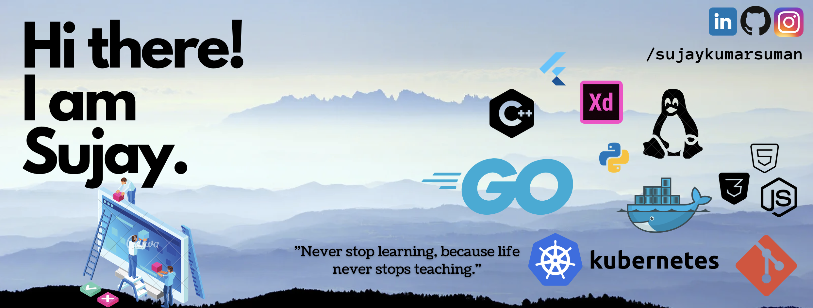

- 🔭 I’m currently working on C++, Data Structure and Algorithms
- 🌱 I’m currently learning Flutter & Node.js
- 📫 How to reach me: [@sujaykumarsuman](https://linkedin.com/in/sujaykumarsuman)
- 💻 https://sujaykumarsuman.github.io/
<!--
- 👯 I’m looking to collaborate on Flutter
- 💬 Ask me about anything
- 🤔 I’m looking for help with Machine Learning
- 😄 Pronouns: SK
- ⚡ Fun fact: 
-->

